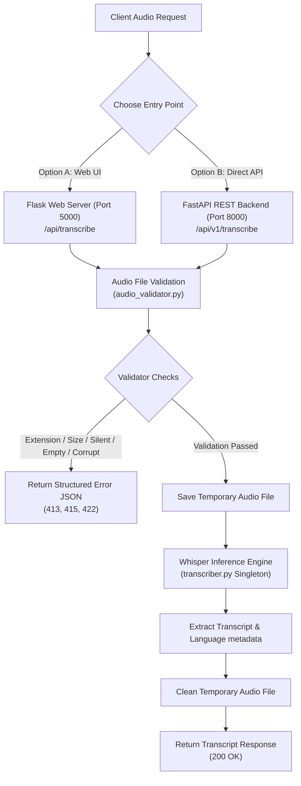

# 🎙️ Production-Ready Speech-to-Text API using Whisper

<div align="center">

[](https://www.python.org)
[](https://developer.mozilla.org/en-US/docs/Web/HTML)
[](https://developer.mozilla.org/en-US/docs/Web/CSS)
[](https://developer.mozilla.org/en-US/docs/Web/JavaScript)

[](https://fastapi.tiangolo.com)
[](https://flask.palletsprojects.com)
[](https://pytest.org)
[](https://github.com/dhanish0711/)

</div>

---

A high-performance, production-ready speech transcription system featuring a **FastAPI** REST backend, a responsive **Flask** glassmorphic web UI, and a robust processing service powered by [OpenAI Whisper](https://github.com/openai/whisper). It is designed to validate uploaded audio (handling empty, corrupt, or unsupported audio), transcribe it asynchronously with low-latency and multithreaded backend workers, and support simple integration.

---

## 📐 System Architecture

The speech transcription system offers two entry points (Web UI via Flask or direct REST API via FastAPI) utilizing shared validation and transcription services:



---

## 🌟 Feature Highlights

### 🤖 Intelligent Speech-to-Text Processing
*   **Whisper Core**: Uses OpenAI's Whisper model (default `base`) to translate audio waves into highly accurate text.
*   **Language Auto-Detection**: Automatically detects the spoken language and returns the identifier alongside the transcript metadata.
*   **Non-Blocking Backend Workers**: Offloads heavy inference tasks to a background thread pool (in Flask) using `ThreadPoolExecutor` and async tasks (in FastAPI) to keep both servers highly responsive.
*   **Auto-Configured FFmpeg on Windows**: Detects and configures the bundled `ffmpeg` executable dynamically from the `imageio-ffmpeg` package, ensuring Whisper processes audio seamlessly on Windows without manual binary installation.

### 🎨 Visual-First Dashboard UI
*   **Modern Glassmorphism Design**: Sleek dark-mode container panels with backdrop-filter effects and smooth micro-animations.
*   **Drag & Drop File Uploader**: Interactive visual upload box supporting simple drag-and-drop or click-to-select options.
*   **Audio Preview Player**: Integrated audio element to listen to the uploaded file before initiating transcription.
*   **Animated Waveform Loader**: Renders an engaging, responsive loading state while the model processes the request.
*   **Clipboard Copy**: Copy your transcript text instantly with a one-click clipboard action.
*   **Responsive Layout**: Optimized layout that scales beautifully from mobile devices to desktop monitors.
*   **Keyboard Shortcut**: Press `Ctrl+Enter` to quickly submit files for transcription.

### 🛡️ Edge-Case Validation Framework
*   **Extension Verification**: Restricts inputs strictly to supported formats (`.wav`, `.mp3`, `.mp4`, `.m4a`, `.ogg`, `.flac`, `.webm`, `.aac`, `.aiff`).
*   **File Size Enforcement**: Instantly rejects files exceeding `MAX_FILE_SIZE_BYTES` (default 100 MB) to protect system memory.
*   **Audio Content Analysis**: Reads the audio file using `soundfile` and computes RMS amplitude (root-mean-square) to detect and reject empty, silent, or too-short (< 0.1s) audio files.
*   **Corrupted File Prevention**: Gracefully catches libsndfile format exceptions, truncated headers, or invalid audio binaries, returning custom HTTP status codes instead of crashing.

---

## 🛠️ Technical Stack

| Component | Technology | Description |
|---|---|---|
| **Backend (API)** | Python 3.13 / FastAPI | Asynchronous REST endpoints, Pydantic settings, and automatic Swagger docs. |
| **Frontend Server** | Flask | Serving static UI files and offering a dedicated Web UI API endpoint. |
| **Inference Engine** | OpenAI Whisper | Advanced speech-to-text translation model. |
| **Audio Mechanics** | soundfile / numpy | Validates audio properties, reads WAV headers, and detects silent frames. |
| **Windows Support** | imageio-ffmpeg | Bundles the FFmpeg binary executable needed by Whisper. |
| **Frontend Style** | HTML5 / CSS3 / Vanilla JS | Sleek glassmorphism, responsive animations, and drag-drop event listeners. |
| **Unit Testing** | Pytest / HTTPX | 43 automated test cases covering error handlers, API routes, and transcriber modules. |

---

## 🚀 Quick Start

### 1. Clone & Activate Environment
```bash
cd "Speech-to-Text API using Whisper"
python -m venv .venv

# Windows
.venv\Scripts\activate
# macOS / Linux
source .venv/bin/activate
```

### 2. Install Dependencies
```bash
pip install -r requirements.txt
```
> **Note**: On the first transcription run, Whisper will automatically download the required model weights (~139 MB for `base`).

### 3. Run the Servers

#### Option A: Flask Frontend (Web UI + API)
```bash
python flask_app.py
```
*The server will start on [http://localhost:5000](http://localhost:5000).*

#### Option B: FastAPI Backend (API-only)
```bash
python main.py
```
*The API will start on [http://localhost:8000](http://localhost:8000).*
- **Swagger Docs**: [http://localhost:8000/docs](http://localhost:8000/docs)
- **ReDoc Docs**: [http://localhost:8000/redoc](http://localhost:8000/redoc)

### 4. Running Automated Tests
To run the full suite of 43 tests:
```bash
pytest tests/ -v --tb=short
```

### 5. Running Code Coverage
To check test coverage reports:
```bash
pip install pytest-cov
pytest tests/ --cov=. --cov-report=term-missing
```

---

## 📡 API Endpoints

### FastAPI Endpoints (Port 8000)

#### 1. Transcribe Audio File
*   **Endpoint**: `POST /api/v1/transcribe`
*   **Payload**: `multipart/form-data`
    *   `audio_file`: binary file (e.g. `candidate.wav`)
*   **Example curl**:
    ```bash
    curl -X POST http://localhost:8000/api/v1/transcribe \
      -F "audio_file=@candidate.wav"
    ```
*   **Example Python (requests)**:
    ```python
    import requests

    with open("candidate.wav", "rb") as f:
        resp = requests.post(
            "http://localhost:8000/api/v1/transcribe",
            files={"audio_file": ("candidate.wav", f, "audio/wav")},
        )

    print(resp.json())
    ```
*   **Response Schema (`200 OK`)**:
    ```json
    {
      "transcript": "REST APIs are stateless.",
      "language": "en",
      "duration_seconds": 3.52,
      "model_used": "base"
    }
    ```

#### 2. Health Status
*   **Endpoint**: `GET /api/v1/health`
*   **Response Schema (`200 OK`)**:
    ```json
    {
      "status": "ok",
      "model_loaded": true,
      "whisper_model": "base",
      "version": "1.0.0"
    }
    ```

---

### Flask Endpoints (Port 5000)

#### 1. Web Page UI
*   **Endpoint**: `GET /`
*   **Response**: Serves the main HTML interface.

#### 2. Web UI Transcription Endpoint
*   **Endpoint**: `POST /api/transcribe`
*   **Payload**: `multipart/form-data` containing `audio_file`
*   **Response Schema (`200 OK`)**:
    ```json
    {
      "transcript": "REST APIs are stateless.",
      "language": "en",
      "duration_seconds": 3.52,
      "model_used": "base"
    }
    ```

#### 3. Health Check
*   **Endpoint**: `GET /api/health`
*   **Response Schema (`200 OK`)**:
    ```json
    {
      "status": "healthy"
    }
    ```

---

## ❌ Error & Edge Case Handling

All validated errors return a structured JSON schema:
```json
{
  "error": "UnsupportedFormatError",
  "detail": "Unsupported audio format: '.xyz'",
  "status_code": 415
}
```

### 1. HTTP Validation Errors

| Condition | HTTP Code | Error Type | Description |
|---|---|---|---|
| Unsupported file extension | `415` | `UnsupportedFormatError` | Uploaded extension not in supported list |
| File exceeds size limit | `413` | `FileTooLargeError` | Uploaded file is larger than 100 MB |
| Corrupted / unreadable file | `422` | `CorruptedFileError` | Audio headers or streams cannot be read |
| Empty / silent audio | `422` | `EmptyAudioError` | Audio consists of zero amplitude or < 0.1s duration |
| Whisper inference failure | `500` | `TranscriptionError` | Whisper engine threw an internal exception |
| No file uploaded | `422` | FastAPI validation | FastAPI multipart parameter validation error |

### 2. Edge Cases Handled

| Edge Case | Validation Point | Response Code |
|---|---|---|
| Non-audio file (e.g. `.txt`) | File extension checker | `415` |
| Zero-byte file | Content and size validator | `422` |
| Silent / All-zero audio | Root-Mean-Square (RMS) validator | `422` |
| Ultra-short file (< 0.1s) | Audio metadata validator | `422` |
| Damaged audio header | soundfile reading failure | `422` |
| Oversized upload (> 100 MB) | Content-length / size validator | `413` |

---

## ⚙️ Configuration & Model Selection

Edit `.env` (copied from `.env.example`) to configure:

| Variable | Default | Description |
|---|---|---|
| `WHISPER_MODEL` | `base` | Model size (`tiny`, `base`, `small`, `medium`, `large`) |
| `MAX_FILE_SIZE_BYTES` | `104857600` | Maximum allowed audio upload size (100 MB) |
| `MIN_AUDIO_DURATION_SECONDS` | `0.1` | Minimum allowed duration for a valid transcription |
| `TEMP_DIR` | `/tmp` | Path used to write temporary files (dynamically resolves on Windows) |

### Whisper Model Comparison

| Model | Parameters | English-only | Multilingual | VRAM | Speed |
|---|---|---|---|---|---|
| `tiny` | 39 M | ✅ | ✅ | ~1 GB | ~32x |
| `base` | 74 M | ✅ | ✅ | ~1 GB | ~16x |
| `small` | 244 M | ✅ | ✅ | ~2 GB | ~6x |
| `medium`| 769 M | ✅ | ✅ | ~5 GB | ~2x |
| `large` | 1550 M | ❌ | ✅ | ~10 GB| 1x |

---

## 🗂️ Project Directory Tree

```
Speech-to-Text API using Whisper/
├── main.py                    # FastAPI entry point launcher
├── app.py                     # FastAPI application factory & CORS setup
├── flask_app.py               # Flask frontend server & web routing
├── requirements.txt           # Package dependencies
├── pyproject.toml             # Pytest framework settings
├── .env.example               # Environment template config
├── bin/                       # Local directory containing copied ffmpeg binary (on Windows)
├── api/
│   ├── __init__.py
│   └── routes.py              # FastAPI POST/GET endpoints
├── core/
│   ├── __init__.py
│   ├── config.py              # Configuration module loaded from environment
│   └── exceptions.py          # Custom exception classes
├── schemas/
│   ├── __init__.py
│   └── models.py              # Pydantic schemas (Responses)
├── services/
│   ├── __init__.py
│   ├── audio_validator.py     # Multi-step audio validation logic
│   └── transcriber.py         # Whisper model manager (Singleton)
├── templates/
│   └── index.html             # Sleek glassmorphic web UI
├── static/
│   ├── css/
│   │   └── style.css          # Color system, glassmorphism, animations
│   └── js/
│       └── app.js             # Drag-drop listener, dynamic player, async fetches
└── tests/
    ├── __init__.py
    └── test_api.py            # Automated tests (43 cases)
```

---

## 🔌 Integration with Audio Workflows

To use this transcription layer in other Python services, import and call `transcribe_audio` directly:

```python
from services.transcriber import transcribe_audio
from pathlib import Path

# Provide absolute path to an audio file
audio_path = Path("c:/path/to/audio.mp3")

try:
    # Transcribes the audio using the model configured in environment
    result = transcribe_audio(audio_path)
    print(f"Transcript: {result.text}")
    print(f"Language: {result.language}")
except Exception as e:
    print(f"Transcription failed: {e}")
```

---

## 📄 License

MIT License

---

**Built with ❤️ by [Dhanish Ladwani (dhanish0711)](https://github.com/dhanish0711/)**
